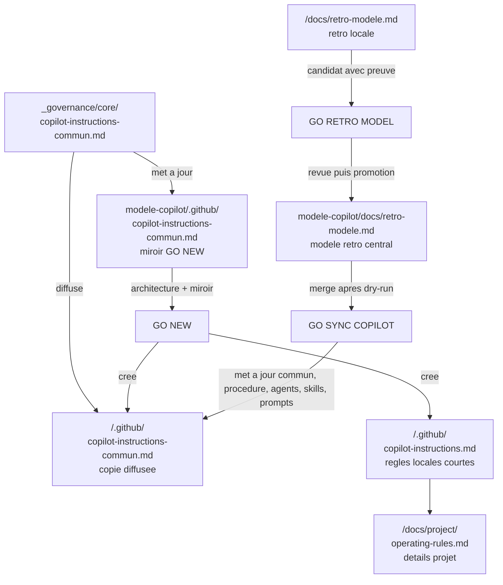

# Procedure qualite - Gouvernance Copilot

**Statut** : procedure operationnelle obligatoire
**Version** : 1.1 - 2026-08-21
**Proprietaire** : humain responsable de la gouvernance
**Execution** : Copilot et scripts de validation
**Perimetre** : depot chapeau, modele-copilot et sous-projets enregistres

Cette procedure explique comment decider, modifier, tester, diffuser et
prouver une regle de gouvernance. Elle complete les documents suivants :

- `governance-operating-model.md` : architecture, roles et flux ;
- `governance-manifest.md` : inventaire des artefacts et destinations ;
- `governance-structure-canonical.md` : structure attendue dans chaque projet ;
- `_governance/action-plan.yaml` : plan de la tranche en cours.

Elle ne remplace pas les regles de securite du fichier commun ni les
procedures Apps Script de l'overlay GAS.

## 1. Architecture cible



### Regle de lecture

- `commun` est la seule couche partagee de regles generales.
- `copilot-instructions.md` est l'entree courte du projet. Il renvoie au
  commun et porte uniquement les decisions locales actives.
- `operating-rules.md` contient le detail necessaire a la comprehension et a
  l'exploitation du projet. Il n'est pas une seconde entree globale.
- `modele-copilot` est le modele de creation GO NEW. Son fichier commun est un
  miroir gere par GO SYNC, pas une deuxieme source de verite.
- Une copie diffusee est un fichier normal dans le depot du projet. Elle peut
  diverger jusqu'a la prochaine diffusion et doit etre controlee par script.

**Decision d'architecture a confirmer** : le modele est-il seulement le
scaffold GO NEW et le miroir du commun, ou reste-t-il aussi la source de
diffusion des agents, skills et prompts ? Le code actuel utilise encore
`modele-copilot/.github/` pour ces composants. Tant que cette question n'est
pas tranchee, la diffusion du commun et de la procedure est sure, mais une
refonte du perimetre agents/skills/prompts ne doit pas etre deduite.

## 2. Roles des fichiers

| Fichier | Nature | Contenu autorise | Source de verite | Ecrasement automatique |
|---|---|---|---|---|
| `_governance/core/copilot-instructions-commun.md` | COMMUN | Regles generiques, securite, sessions, plans, Git | Ce fichier | Oui apres dry-run |
| `modele-copilot/.github/copilot-instructions-commun.md` | MIROIR | Copie du commun pour GO NEW | `_governance/core/` | Oui par GO SYNC |
| `<projet>/.github/copilot-instructions-commun.md` | COPIE COMMUNE | Copie du commun active dans le projet | `_governance/core/` | Oui apres dry-run |
| `<projet>/.github/copilot-instructions.md` | LOCAL ACTIF | Regles courtes, compte, overlay et choix du projet | Depot du projet | Non; seul un bloc marque peut etre gere |
| `<projet>/docs/project/operating-rules.md` | DETAIL LOCAL | Contexte metier, IDs, triggers, decisions, rollback | Depot du projet | Non; seul un bloc marque peut etre gere |
| `modele-copilot/.github/agents/` | MODELE PARTAGE | Agents reutilisables | `modele-copilot` | Fusion controlee |
| `modele-copilot/.github/skills/` | MODELE PARTAGE | Skills reutilisables | `modele-copilot` | Fusion controlee |
| `<projet>/docs/retro-modele.md` | RETRO LOCALE | Faits, apprentissages, candidats | Depot du projet | Merge, jamais remplacement |
| `modele-copilot/docs/retro-modele.md` | RETRO CENTRALE | Patterns generiques promus | GO RETRO MODEL | Merge puis diffusion |

### 2.1 `copilot-instructions.md` et `operating-rules.md`

Ils ne sont pas redondants si la frontiere est respectee :

- `copilot-instructions.md` repond a : **quelles regles courtes dois-je
  appliquer maintenant ?**
- `operating-rules.md` repond a : **pourquoi, avec quel contexte, quel compte,
  quel ID, quel trigger et quel rollback ?**

Une regle active tient en une ligne et renvoie au detail. Une explication,
un tableau ou une procedure longue va dans `operating-rules.md`. Si le meme
texte est copie dans les deux fichiers, il y a doublon et la regle doit etre
ramenee a une seule source.

`copilot-instructions.md` repond a : **quelles regles dois-je appliquer
maintenant ?** `operating-rules.md` repond a : **comment le projet fonctionne,
pourquoi la regle existe et comment la verifier ?** Le second ne remplace pas
le premier et ne doit pas contenir une deuxieme version concurrente.

## 3. Arbitrage local ou commun

### 3.1 Decision par defaut

Une nouvelle regle reste **LOCALE** par defaut. Elle devient **COMMUNE**
seulement si tous les criteres suivants sont satisfaits :

| Critere | Question de controle |
|---|---|
| Portee | S'applique-t-elle a au moins deux projets independants ? |
| Generalite | Peut-on la formuler sans nom de projet, ID, compte ou metier local ? |
| Repetition | Est-elle observee au moins deux fois ou necessaire preventivement ? |
| Testabilite | Existe-t-il une commande, un controle ou un scenario qui prouve la regle ? |
| Stabilite | Le comportement cible est-il durable et non lie a une migration courte ? |
| Risque | Sa diffusion ne risque-t-elle pas de casser une exception legitime ? |
| Rollback | Peut-on revenir a la version precedente sans perte metier ? |

Si un critere est `NON`, la regle reste locale ou devient un candidat a
surveiller. Une regle de securite commune peut etre proposee apres une seule
occurrence grave, mais elle doit alors porter une preuve de risque et un test.

### 3.2 Matrice de classement

| Exemple | Classe | Destination |
|---|---|---|
| Interdire les secrets en clair | COMMUN | `core/copilot-instructions-commun.md` |
| Exiger un plan avant une action | COMMUN | `core/copilot-instructions-commun.md` |
| Compte clasp d'un projet | LOCAL + REGISTRE | instructions locales et registre |
| ID de deployment | LOCAL | `operating-rules.md` |
| Contrat d'un endpoint partage par deux applications | A ARBITRER | decision log puis commun si generique |
| Bug propre a un projet | LOCAL | retro et docs du projet |
| Meme bug dans deux projets avec meme cause | CANDIDAT COMMUN | retro central apres preuve |
| Convention d'une seule equipe | LOCAL | instructions du projet |

### 3.3 Regles de priorite

1. Une regle `SEC` commune ne peut jamais etre affaiblie par une regle locale.
2. Une regle locale peut ajouter une contrainte plus stricte.
3. Une exception locale doit etre ecrite, justifiee et testee dans
   `operating-rules.md` et le decision log du projet.
4. Une contradiction entre commun et local bloque la diffusion jusqu'a
   arbitrage. Elle ne se resout pas par le dernier fichier modifie.

## 4. Retro : ce qui est ajoute et ce qui ne l'est pas

### 4.1 Trois objets differents

- `retro.md` est la procedure partagee : elle explique comment analyser la
  session et rediger un pattern.
- `docs/retro-modele.md` est la memoire de patterns du projet : elle recoit
  les apprentissages locaux, en append-only.
- `modele-copilot/docs/retro-modele.md` est la memoire centrale : elle ne
  recoit que les patterns generiques retenus apres revue.

Un retro n'ajoute donc pas automatiquement une regle commune. Il ajoute un
fait, une cause, une action et une preuve au niveau local. La promotion est
une decision separee.

### 4.2 Cycle de promotion

1. Le projet documente le pattern dans `docs/retro-modele.md` ou son decision
   log avec le tag `[RETRO-MODELE]`.
2. Le pattern indique contexte, cause, impact, regle proposee, test, rollback,
   recurrence et date.
3. `GO RETRO MODEL` est lance en dry-run.
4. Les doublons sont ignores et les candidats sont classes par section.
5. L'humain decide `PROMOUVOIR`, `GARDER LOCAL` ou `REJETER` selon la matrice
  d'arbitrage ci-dessous.
6. Apres `PROMOUVOIR`, le modele central est modifie et valide.
7. `GO SYNC COPILOT` diffuse le modele retro et le commun selon son dry-run.
8. Chaque projet est controle; la preuve est conservee dans le plan et le
   decision log.

### 4.3 Ce qui ne doit pas etre promu

- un ID, un compte, une URL ou un trigger propre a un projet ;
- une preference d'equipe sans recurrence inter-projets ;
- une correction non testee ;
- une regle qui affaiblit la securite commune ;
- une solution temporaire sans date de retrait.

## 5. Procedures executables

### P0 - Ouverture

1. Se placer dans `D:\Projets_App_Script`.
2. Lire `projet-status.yaml` ou `_governance/action-plan.yaml`.
3. Valider le plan :

```powershell
Set-Location 'D:\Projets_App_Script'
.\_scripts\validate-action-plan.ps1 -ProjectPath . -Phase Pre
```

4. Identifier le depot concerne et son remote. Ne pas toucher aux autres
   depots sales.

**Preuve** : sortie `[PASS] Action plan gate passed.` et chemin courant.

Le perimetre des projets diffusables est celui du tableau de
`_governance/clasp-project-registry.md`. Un dossier present sur le disque mais
absent du registre est hors diffusion et doit etre arbitre avant d'etre ajoute.

### P1 - Modifier une regle commune

1. Modifier uniquement `_governance/core/copilot-instructions-commun.md`.
2. Ajouter ou mettre a jour le test correspondant dans la matrice.
3. Verifier les secrets et les references locales interdites.
4. Lancer le dry-run de migration si le nom ou la structure change.
5. Lancer le dry-run de GO SYNC sur les projets cibles.
6. Examiner la liste des fichiers modifies et le diff.
7. Appliquer la diffusion seulement apres decision explicite.

**Blocage** : copie locale divergente, overlay inattendu, test manquant,
secret, ou instruction locale annoncee comme ecrasee.

Le script d'ancrage clasp ne peut modifier qu'un bloc delimite par
`GOVERNANCE-MANAGED`. Une section existante sans marqueur est conservee et
signalee en warning; elle necessite une migration locale explicite.

### P2 - Modifier une regle locale

1. Modifier `<projet>/.github/copilot-instructions.md` pour une regle courte.
2. Mettre le detail dans `docs/project/operating-rules.md`.
3. Ajouter la preuve dans `projet-status.yaml` ou le decision log.
4. Ne pas modifier le commun ni lancer une diffusion globale.

**Preuve** : diff du depot projet et test local cible.

### P3 - GO NEW

Le script doit :

1. lire et valider le plan du workspace ;
2. verifier que le miroir commun de `modele-copilot` est aligne avec la source
   `_governance/core/` ;
3. creer l'architecture projet ;
5. copier le miroir `copilot-instructions-commun.md` valide ;
6. copier `_governance/governance-quality-procedure.md` ;
7. creer `copilot-instructions.md` local et `operating-rules.md` ;
8. creer les prompts, agents, skills et hooks demandes ;
9. produire un dry-run avant toute creation reelle ;
10. laisser `scriptId`, deployment et secrets en `TO_CONFIRM` tant qu'ils ne
   sont pas arbitres.

**Preuve** : dry-run, hash commun source/miroir, structure V7, plan projet et depot Git initial.

### P4 - GO SYNC COPILOT

Le wrapper safe doit suivre exactement ce cycle :

```text
Pre plan
  -> dry-run commun vers modele-copilot et projets
  -> dry-run overlay clasp
  -> controle des conflits et locales
  -> decision d'application
  -> diffusion commun/agents/skills/hooks/prompts/retro
  -> validation discovery et structure
  -> preuve par projet
```

GO SYNC ne fait jamais `clasp push`, `clasp version` ou `clasp deploy`.

**Preuves minimales** :

- nombre de projets cibles et noms ;
- fichiers communs presents ;
- instruction locale non ecrasee ;
- overlays coherents avec les signatures ;
- discovery PASS ;
- diff de propagation sans secret ;
- statut Git de chaque depot concerne.

Commandes de verification apres execution :

```powershell
Set-Location 'D:\Projets_App_Script'
.\_scripts\validate-governance-structure.ps1
.\_scripts\audit-diff-projets.ps1
.\_scripts\validate-copilot-discovery.ps1
```

Le verdict est `PASS` seulement si ces trois controles passent, si le nombre
de projets correspond au registre et si aucun fichier
`copilot-instructions.md` local n'apparait dans les fichiers modifies.

### P5 - GO PUSH

GO PUSH est separe de la gouvernance. Il exige le compte clasp verifie,
le deployment ID arbitre et la sequence Apps Script de l'overlay GAS. Aucun
GO SYNC ou GO NEW ne peut le declencher implicitement.

## 6. Gates de qualite

| Gate | Question | Commande ou preuve | Decision si echec |
|---|---|---|---|
| Q0 Perimetre | Les projets et fichiers sont-ils connus ? | plan + `Get-Location` + statut Git | Stop |
| Q1 Plan | Le plan est-il valide ? | `validate-action-plan.ps1 -Phase Pre` | Stop |
| Q2 Source | La regle est-elle dans la bonne source ? | classification local/commun/retro | Reclasser |
| Q3 Syntaxe | Les scripts sont-ils valides ? | validateur PowerShell disponible | Corriger |
| Q4 Dry-run | Le changement est-il visible et limite ? | GO NEW/GO SYNC `-DryRun` | Stop |
| Q5 Non-regression | La structure et discovery passent-elles ? | validateurs structure/discovery | Stop |
| Q6 Diffusion | Les copies attendues sont-elles identiques ? | audit diff + hashes | Corriger ou rollback |
| Q7 Tracabilite | La decision et la preuve sont-elles conservees ? | plan + decision log + Git | Ne pas clore |
| Q8 Publication | Une publication externe est-elle demandee ? | GO PUSH uniquement | Aucun push implicite |

### Q9 Couverture

Le registre, le dry-run et V7 doivent donner le meme ensemble de projets.
Une difference de perimetre est une anomalie de gouvernance, pas un simple
warning. Elle bloque la cloture jusqu'a correction ou decision tracee.

## 7. Rollback

### Avant diffusion

Annuler la tranche sans toucher aux projets. Le dry-run ne modifie rien.

### Apres diffusion de fichiers communs

1. identifier le commit ou le checkpoint de chaque depot ;
2. restaurer la version precedente du fichier commun uniquement ;
3. relancer les validateurs ;
4. conserver l'instruction locale du projet ;
5. documenter la cause dans le plan et le decision log.

Une suppression recursive, un `reset --hard` et un rollback metier sont
interdits sans decision explicite.

## 8. Definition of Done

La tranche est `verified` seulement si :

- la source de verite et la classe de la regle sont indiquees ;
- le nom `commun` est utilise dans tous les chemins actifs ;
- `copilot-instructions.md` local n'a pas ete ecrase ;
- `operating-rules.md` ne duplique pas le texte actif ;
- le dry-run et les validateurs passent ;
- les projets cibles et les preuves sont enumeres ;
- le rollback est possible ;
- le plan contient l'evidence finale ;
- aucun deploiement Apps Script n'a ete implicite.

## 9. Formulaire de decision

Toute promotion local -> commun doit laisser une trace sous cette forme dans
un decision log :

```text
[DECISION-GOUVERNANCE] YYYY-MM-DD - <titre>
- Classe: LOCAL | CANDIDAT-COMMUN | COMMUN | REJETE
- Projets concernes: <liste>
- Preuves: <bugs, occurrences, tests ou risques>
- Cause commune: <oui/non + explication>
- Impact diffusion: <fichiers et projets>
- Test: <commande ou scenario>
- Rollback: <procedure>
- Arbitrage: <decision et personne>
- Date de revue: <YYYY-MM-DD ou N/A>
```

Une entree sans preuve, test et rollback reste locale.

## 10. Arbitrage qualite et responsabilites

### 10.1 Qui decide

| Decision | Propose | Verifie | Arbitre final | Trace |
|---|---|---|---|---|
| Regle locale | Copilot ou proprietaire projet | Responsable projet | Responsable projet | `projet-status.yaml` ou decision log |
| Candidat commun | Copilot via retro ou proprietaire projet | Verification + documentation | Humain responsable gouvernance | decision log avec `[DECISION-GOUVERNANCE]` |
| Modification du commun | Responsable gouvernance | Validation scripts + projet pilote | Humain responsable gouvernance | plan + decision log racine |
| Exception de securite | Personne ne peut l'auto-approuver | Revue securite | Humain explicitement identifie | decision log + preuve de test |
| Diffusion multi-projet | Copilot prepare | Dry-run + audit diff | Humain via GO SYNC explicite | sortie dry-run + plan |

### 10.2 Questions obligatoires d'arbitrage

Avant de promouvoir une regle, repondre par `oui/non` :

1. La regle s'applique-t-elle a au moins deux projets actuels ou futurs ?
2. Est-elle independante des IDs, comptes, URLs, metier et donnees d'un projet ?
3. Une cause commune est-elle demontree, et pas seulement un resultat similaire ?
4. Le test detecte-t-il une violation de facon reproductible ?
5. La diffusion est-elle retrocompatible avec les projets existants ?
6. Le rollback est-il localisable fichier par fichier ?
7. Une exception locale est-elle possible sans dupliquer la regle ?

Deux `non` ou plus imposent `GARDER LOCAL` ou `CANDIDAT A REEVALUER`.
Une seule occurrence critique de securite peut justifier `COMMUN`, mais le
test et la justification de risque sont obligatoires.

### 10.3 Decision retro : local ou commun

Une retro locale reste locale tant qu'elle decrit un contexte, une cause ou
une implementation propre au projet. Elle devient candidate commune lorsque
la cause est reproductible dans un autre projet, la regle est formulable sans
contexte local et un test commun peut etre execute.

La retro centrale n'est donc pas un tiroir de regles automatiques. C'est une
liste de patterns approuves qui alimentent le commun seulement apres une
decision explicite.

## 11. Cartographie des documents

| Document | Question a laquelle il repond | Ne doit pas contenir |
|---|---|---|
| `governance-manifest.md` | Quels artefacts existent, qui les possede et ou vont-ils ? | Procedure detaillee ou decision metier |
| `governance-structure-canonical.md` | Quelle arborescence minimale chaque projet doit-il avoir ? | Regles de classement ou historique complet |
| `governance-operating-model.md` | Comment les couches s'articulent-elles ? | Toutes les commandes et tous les criteres de recette |
| `governance-quality-procedure.md` | Comment classer, modifier, tester, diffuser et rollbacker ? | Inventaire exhaustif des fichiers |
| `copilot-instructions-commun.md` | Quelles regles communes Copilot applique-t-il ? | Contexte metier d'un projet |
| `<projet>/.github/copilot-instructions.md` | Quelles decisions courtes sont propres a ce projet ? | Copie du commun ou longue documentation |
| `<projet>/docs/project/operating-rules.md` | Quel est le fonctionnement detaille et verifiable du projet ? | Regles communes concurrentes |
| `docs/retro-modele.md` | Quels apprentissages ce projet a-t-il faits ? | Promotion automatique |
| `modele-copilot/docs/retro-modele.md` | Quels patterns generiques sont retenus ? | Faits non revus ou secrets |

## 12. Decisions restantes

| ID | Question | Option recommandee | Effet si non tranche | Date de revue |
|---|---|---|---|---|
| GOV-001 | `modele-copilot` diffuse-t-il agents/skills/prompts ou sert-il uniquement GO NEW + miroir commun ? | DECIDE: Option A; il reste modele GO NEW et source agents/skills projet | Decision tracee dans `_governance/decision-log-2026-08-20.md`; Option B devient une migration future distincte | 2026-09-20 |
| GOV-002 | Les blocs clasp historiques non marques doivent-ils etre migres ? | Oui, migration explicite projet par projet | Les comptes restent proteges par preservation, mais non rafraichis automatiquement | 2026-09-21 |
| GOV-003 | Les projets absents du registre doivent-ils etre actifs ? | Les inscrire avant diffusion | V7 et GO SYNC les excluent volontairement | 2026-09-21 |

## 13. Cycle de vie des agents et des skills

### 13.1 Etat reel au 2026-08-20

| Objet | Nombre | Source effective | Copie projet | Controle |
|---|---:|---|---|---|
| Agents projet | 8 | `modele-copilot/.github/agents/` | `.github/agents/<nom>.agent.md` | frontmatter + propagation + discovery |
| Skills projet | 19 | `modele-copilot/.github/skills/` | `.github/skills/<nom>/SKILL.md` | registre + frontmatter + propagation + discovery |
| Skills workspace-only | 0 installes | `.agents/skills/` declare mais absent | aucune | a activer avant usage |
| Lock upstream | inactif | `skills-lock.json` absent | aucune | statut explicite dans le registre |

Les agents et skills ne sont pas declenches par une modification du commun.
Cependant, le `GO SYNC COPILOT` actuel execute le paquet complet : il relit
le commun, les overlays, les agents, les skills, les hooks, les prompts et les
retros. Les fichiers agents/skills sont donc reexamines a chaque sync; leur
contenu ne change que si la source canonique a change. C'est une diffusion de
paquet, pas une diffusion conditionnelle par fichier.

### 13.2 Ajout ou modification d'un agent/skill

1. Classer le changement : `ADD`, `UPDATE`, `RETIRE`, `REPLACE` ou
  `PROJECT_ONLY`.
2. Modifier le fichier canonique dans la source declaree par le registre.
3. Mettre a jour dans le meme changement :
  - `skills-registry.yaml` : liste, scope, action, role, overlap, boundary ;
  - `modele-copilot/.github/skills/README.md` si l'index lisible change ;
  - le decision log si le perimetre ou le comportement change ;
  - le plan et la matrice de test si un nouveau gate est necessaire.
4. Executer le gate de release :

```powershell
Set-Location 'D:\Projets_App_Script'
.\_scripts\validate-governance-components.ps1
```

5. Executer le dry-run `GO SYNC COPILOT` et lire les projets/fichiers cibles.
6. Obtenir `GO SYNC COPILOT` explicite pour la diffusion reelle.
7. Executer les preuves post-release :

```powershell
.\_scripts\validate-agents-skills.ps1
.\_scripts\validate-skill-propagation.ps1
.\_scripts\validate-copilot-discovery.ps1
.\_scripts\validate-governance-structure.ps1
```

8. Committer et pousser chaque depot concerne separement.

### 13.3 Ce qui est diffuse exactement

**Agents**

- La source est un fichier `<nom>.agent.md`.
- Le projet recoit le meme fichier dans `.github/agents/`.
- Le merge conserve les agents propres au projet.
- Un agent canonique du meme nom remplace la copie projet lors d'une release.
- Une suppression n'est jamais implicite; elle passe par une retraite explicite.

**Skills**

- La source est un fichier plat `<nom>.md` dans le modele.
- Le projet recoit `.github/skills/<nom>/SKILL.md` pour la decouverte VS Code.
- Le merge conserve les skills propres au projet.
- Un skill canonique du meme nom remplace la copie projet lors d'une release.
- `vsg-integration` reste opt-in selon `projet-status.yaml`.
- Les skills retires restent presents tant que `-ApplyRetirements` n'est pas
  explicitement ajoute et revise.

### 13.4 Mise a jour du registre

Le registre n'est pas mis a jour automatiquement a partir des noms de fichiers
car il porte une decision humaine : scope, action, chevauchements, limites,
retirement et diffusion. La regle est :

```text
fichier canonique change
  -> registry change dans le meme changement
  -> README/index change si necessaire
  -> validate-governance-components
  -> dry-run
  -> GO SYNC
  -> validations post-release
```

Le gate compare maintenant la liste `agents.names` et la liste
`project_skills` du registre avec les fichiers reels. Une difference est bloquante. Les
metadonnees semantiques restent relues par l'humain.

### 13.5 Instruction seule ou release de composants

Une modification de `copilot-instructions-commun.md` doit normalement
entrainer une release `COMMON` : commun, miroir modele, procedure qualite et
copies projet. Elle ne doit pas modifier le contenu des agents ou skills.

Une modification d'agent ou de skill est une release `COMPONENTS` : registre,
source canonique, copies, discovery et propagation. Elle ne doit pas modifier
les regles communes sans decision separee.

Le script actuel reste un paquet `FULL` pour compatibilite. Apres GOV-001
Option A, toute utilisation de `GO SYNC COPILOT` est une release complete
preparee par dry-run. Une separation technique `COMMON`/`COMPONENTS` reste
possible plus tard, mais elle n'est pas necessaire pour la gouvernance actuelle.

## 14. Analyse des cinq pourquoi

**Probleme** : une mise a jour d'instructions peut entrainer une diffusion
d'agents/skills dont le perimetre et le registre ne sont pas immediatement
lisibles.

1. **Pourquoi ?** Parce que `GO SYNC COPILOT` lance le synchroniseur du modele
  qui traite commun, agents, skills, hooks, prompts et retros ensemble.
2. **Pourquoi ?** Parce que le synchroniseur considere `modele-copilot/.github`
  comme paquet source unique des composants projet.
3. **Pourquoi ?** Parce que le registre de skills decrit la politique mais ne
  pilotait pas le perimetre exact de publication.
4. **Pourquoi ?** Parce que le safe wrapper ne lancait pas le controle du
  registre avant le dry-run et ne rejouait pas tous les controles apres sync.
5. **Pourquoi ?** Parce que l'architecture n'avait pas de contrat de release
  explicite separant source, index, mecanique de copie et preuve.

**Cause racine** : absence d'un manifeste de release executable et d'un gate
unique reliant registre, sources canoniques, copies projet et validations.

**Correction engagee** : `skills-registry.yaml` porte maintenant les listes
exactes et le cycle de release; `validate-governance-components.ps1` controle
le contrat; `go-sync-copilot-safe.ps1` l'appelle avant diffusion et execute
les controles propagation/structure apres diffusion.

**Decision d'architecture retenue GOV-001** : conserver `modele-copilot` comme
source des composants projet, modele GO NEW et miroir du commun. `_governance`
reste la source de politique, du contrat de release, des overlays et des
validateurs. Un futur passage a l'Option B serait une migration distincte,
avec plan, dry-run, rollback et decision propres.

### 14.1 Quand declencher les cinq pourquoi

Les cinq pourquoi sont obligatoires si le sujet contient un bug recurrent, une
contradiction entre fichiers ou scripts, une derive de copie, une decision de
gouvernance, un risque de securite, un echec de validation ou une demande dont
le perimetre semble trop petit par rapport a son impact.

Ils ne sont pas obligatoires pour une correction locale triviale dont la cause
est deja prouvee et le rollback evident.

### 14.2 Protocole executable

1. Reformuler la demande en une question de resultat : **quel comportement
  doit etre vrai a la fin ?**
2. Ecrire le symptome observe, sans y melanger la cause supposee.
3. Poser `Pourquoi ?` jusqu'a cinq fois, ou s'arreter plus tot si la cause
  racine est prouvee et directement controlable.
4. Pour chaque reponse, indiquer `FAIT` ou `HYPOTHESE` et ajouter le fichier,
  la commande ou le scenario qui la soutient.
5. Distinguer la cause immediate de la cause systemique : source de verite,
  ownership, processus, gate absent, test absent ou decision non tracee.
6. Transformer la cause racine en action classee `LOCAL`, `COMMUN` ou
  `PROCESS`.
7. Ajouter un test de non-regression et un rollback avant de modifier.

### 14.3 Format de preuve

```text
[ROOT-CAUSE] YYYY-MM-DD - <sujet>
- Question reformulee: <resultat attendu>
- Symptome: <fait observe>
- Pourquoi 1: <reponse> [FAIT|HYPOTHESE] - <preuve>
- Pourquoi 2: <reponse> [FAIT|HYPOTHESE] - <preuve>
- Pourquoi 3: <reponse> [FAIT|HYPOTHESE] - <preuve>
- Pourquoi 4: <reponse> [FAIT|HYPOTHESE] - <preuve>
- Pourquoi 5: <reponse> [FAIT|HYPOTHESE] - <preuve>
- Cause racine: <cause controlable>
- Classe: LOCAL | COMMUN | PROCESS
- Action: <fichier ou processus a modifier>
- Test: <commande ou scenario>
- Rollback: <retour possible>
- Decision: <arbitrage et date>
```

Une chaîne de cinq pourquoi sans preuve n'est qu'une opinion structurée. Elle
ne permet pas de classer une règle en COMMUN et ne clôt pas une tranche.
